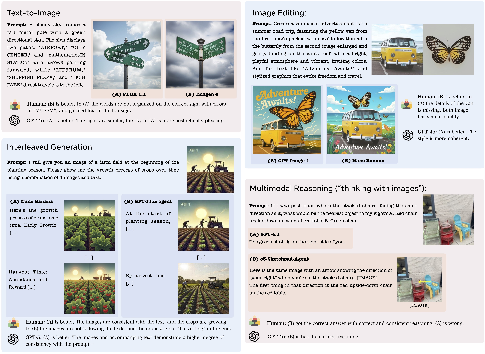
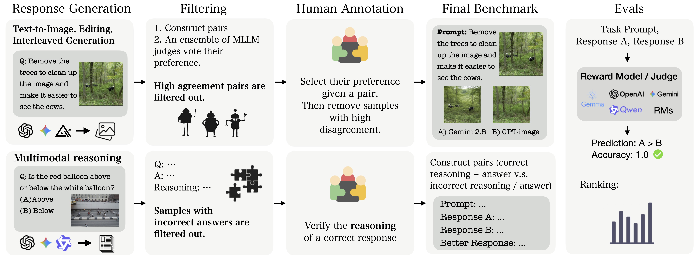
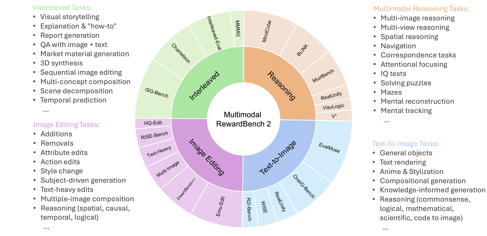

# Multimodal RewardBench 2 (MMRB2)

**[Meta FAIR](https://ai.meta.com/research/)**

[Yushi Hu*](https://yushi-hu.github.io/), [Reyhane Askari-Hemmat*](https://reyhaneaskari.github.io/), [Melissa Hall](https://ai.meta.com/people/440919051691552/melissa-hall/), [Emily Dinan](https://ai.meta.com/people/767581351981566/emily-dinan/), [Luke Zettlemoyer](https://homes.cs.washington.edu/~lsz/), [Marjan Ghazvininejad](https://www.linkedin.com/in/marjan-ghazvininejad/)

Reward models (RMs) are essential for training large language models (LLMs), but remain underexplored for omni models that handle interleaved image and text sequences. We introduce **Multimodal RewardBench 2 (MMRB2)**, the first comprehensive benchmark for reward models on multimodal understanding and (interleaved) generation. MMRB2 spans four tasks: text-to-image, image editing, interleaved generation, and multimodal reasoning ("thinking-with-images"), providing 1,000 expert-annotated preference pairs per task from 23 models and agents across 21 source tasks. MMRB2 is designed with: (1) practical but challenging prompts; (2) responses from state-of-the-art models and agents; and (3) preference pairs with strong human-expert consensus, curated via an ensemble filtering strategy. 

<p align="center">
  
  <br>
  <em>Examples of MMRB2</em>
</p>

Using MMRB2, we study existing judges for each subtask, including multimodal LLM-as-a-judge and models trained with human preferences. The latest Gemini 3 Pro attains 75-80% accuracy. GPT-5 and Gemini 2.5 Pro reach 66-75% accuracy, compared to >90% for humans, yet surpass the widely used GPT-4o (59%). The best performing open-source model Qwen3-VL-32B achieves similar accuracies as Gemini 2.5 Flash (64%). We also show that MMRB2 performance strongly correlates with downstream task success using Best-of-N sampling and conduct an in-depth analysis that shows key areas to improve the reward models going forward.

<p align="center">
  
  <br>
  <em>Benchmark curation pipeline</em>
</p>

## 📋 Overview

This repo provides the data and evaluation codes for MMRB2:
- **4 Task Categories**: text-to-image, image editing, interleaved text and image, and multimodal reasoning
- **4,000 Evaluation Pairs**: Generated by SOTA models and agents (e.g., GPT-5 and Nano Banana)
- **Diverse Sources**: Curated practical but challenging task prompts aggregated from 20+ benchmark datasets, and newly created ones
- **Human Annotations**: High-quality preference labels indicating which model output is better
- **Standardized Evaluation**: Positional-consistent evaluation protocol

<p align="center">
  
  <br>
  <em>Breakdown of MMRB2 by task type and source, and detailed categories under each task</em>
</p>


## 🏗️ Repository Structure

```
MMRB2/
├── benchmark/           # Benchmark data and build scripts
│   ├── sources/         # Source modules for downloading data
│   ├── *_response_only.json  # Response data (prompts downloaded at build time)
│   ├── run_release.sh   # Main build script
│   └── ...
├── evaluate/            # Evaluation scripts
│   ├── generate_judgements/  # Part 1: Generate judgements using LLM judges
│   └── compute_scores/       # Part 2: Compute accuracy from judgement files
├── requirements.txt     # Python dependencies
├── LICENSE              # CC BY-NC 4.0 License
├── CODE_OF_CONDUCT.md   # Community guidelines
├── CONTRIBUTING.md      # Contribution guidelines
└── README.md
```

## 🚀 Quick Start

### Installation

```bash
# Clone the repository
git clone https://github.com/facebookresearch/MMRB2.git
cd MMRB2

# Install dependencies
pip install -r requirements.txt
```

### Building the Benchmark

The benchmark data requires downloading prompts from original sources and images from HuggingFace:

```bash
cd benchmark
./run_release.sh
```

This will:
1. Download response images from HuggingFace (`facebook/MMRB2_image`)
2. Download and merge prompts from original benchmark sources
3. Finalize the release with proper image paths
4. Clean up intermediate files

After building, you'll have:
- `t2i.json`, `edit.json`, `interleaved.json`, `reasoning.json` - Complete benchmark files
- `images/` - Response images
- `input_images/` - Input/prompt images
```

## 📊 Data Format

Each task JSON file contains pairs with the following structure:

```json
{
  "pairs": [
    {
      "pair_id": "unique_pair_id",
      "prompt_source": "source_benchmark_name",
      "prompt_content": [
        ["text", "Describe this image..."],
        ["image", "input_images/image.jpg"]
      ],
      "prompt_metadata": { ... },
      "response_a": {
        "model": "model_a_name",
        "response_content": [
          ["image", "images/response_a.jpg"],
          ["text", "Response text..."]
        ]
      },
      "response_b": {
        "model": "model_b_name", 
        "response_content": [
          ["image", "images/response_b.jpg"],
          ["text", "Response text..."]
        ]
      },
      "chosen": "A" | "B"
      "human_annotations": {...}
    }
  ]
}
```

## 📈 Evaluation

### Part 1: Generate Judgements (Optional)

**You can evaluate any reward models by save their predictions in the same format as sample judgement files in `evaluate/generate_judgements/outputs/`, and see step 2**

Here we also provide example implementations of multimodal LLM judges for GPT-4o, Gemini 2.5 Flash, and Qwen3-VL-8B, and you can easily add other LLMs. See [`evaluate/README.md`](evaluate/README.md) for detailed setup and instructions on adding custom models. Note that the reward model is not limited to LLM judges. You can skip this part if you implemented your own.
```bash
cd evaluate/generate_judgements
./run_gpt4o.sh  # or run_gemini25flash.sh, run_qwen3.sh
```

### Part 2: Compute Accuracy

We provide sample judgement files in `evaluate/generate_judgements/outputs/`. To compute accuracy:

```bash
cd evaluate/compute_scores

# Evaluate a single task
python compute_accuracy.py --task image \
    --predictions ../generate_judgements/outputs/sample_task1_image.json

# Evaluate all 4 tasks
python compute_accuracy.py --task all \
    --predictions ../generate_judgements/outputs/sample_task1_image.json \
                  ../generate_judgements/outputs/sample_task2_edit.json \
                  ../generate_judgements/outputs/sample_task3_interleaved.json \
                  ../generate_judgements/outputs/sample_task4_reasoning.json
```

Example output:
```
==================================================
SUMMARY
==================================================
Task                      Accuracy     Missing
--------------------------------------------------
task1_image                53.20%      0
task2_edit                 55.50%      0
task3_interleaved          57.50%      0
task4_reasoning            47.50%      0
--------------------------------------------------
Overall                    53.42%
==================================================
```

## Model Performance Results

| Judge | Text-to-Image | Image Editing | Interleaved | Reasoning | Avg. |
|-------|--------------|---------------|----------------------|---------------------|------|
| **Open-source multimodal LLM-as-a-judges**  |
| Gemma 3 4B | 51.7 | 51.0 | 51.3 | 48.8 | 50.7 |
| Gemma 3 12B | 56.0 | 58.0 | 58.0 | 49.3 | 55.3 |
| Gemma 3 27B | 58.3 | 60.2 | 61.1 | 49.4 | 57.3 |
| Qwen2.5-VL-7B | 50.4 | 57.1 | 48.4 | 47.5 | 50.9 |
| Qwen2.5-VL-72B | 59.1 | 64.6 | 62.3 | 50.0 | 59.0 |
| Qwen3-VL-8B | 59.4 | 61.7 | 61.5 | 54.6 | 59.3 |
| Qwen3-VL-32B | 64.1 | 67.3 | 70.5 | 56.6 | 64.6 |
| Qwen3-VL-30BA3B | 60.0 | 59.5 | 57.3 | 57.3 | 58.5 |
| Qwen3-VL-235BA22B | 62.0 | 64.8 | 69.0 | 55.9 | 62.9 |
| **Other open reward models**  |
| CLIPScore | 51.0 | - | - | - | - |
| ImageReward | 54.0 | - | - | - | - |
| HPSv2 | 54.7 | - | - | - | - |
| VQAScore (Qwen2.5-VL-7B) | 58.3 | - | - | - | - |
| PickScore | 58.6 | - | - | - | - |
| HPSv3 | 60.2 | - | - | - | - |
| EditReward | - | 67.2\* | - | - | - |
| UnifiedReward | 59.8 | - | - | 55.1\* | - |
| **API-based models** |
| GPT-4o | 60.3 | 65.0 | 61.5 | 51.9 | 59.7 |
| GPT-4.1 | 65.8 | 68.2 | 67.0 | 53.0 | 63.5 |
| GPT-5 | **70.5** | **73.8** | **74.4** | **70.2** | **72.2** |
| Gemini 2.5 Flash | 63.1 | 66.5 | 69.4 | 57.5 | 64.1 |
| Gemini 2.5 Pro | **70.5** | 71.3 | **75.1** | 66.6 | **70.9** |
| Gemini 3 Pro | **74.4** | **74.9** | **76.4** | **79.5** | **76.3** |


**Note:** Bold values indicate the highest scores in each category. Numbers with \* are evaluated on the single-image subset of corresponding task.

## 🤝 Contributing

We welcome contributions! Please see [CONTRIBUTING.md](CONTRIBUTING.md) for guidelines.

## 📧 Contact

For questions or issues, please open a GitHub issue.

## Code of Conduct

Please read our [Code of Conduct](CODE_OF_CONDUCT.md) before participating in our community.

## ⚠️ Notice

**This data is released under CC BY-NC 4.0 and is intended for benchmarking purposes only. This dataset should not be used for training models.**

Third-party content (prompts, images from source benchmarks) pulled from other locations are subject to their own licenses and you may have other legal obligations or restrictions that govern your use of that content.

**AI-Generated Content Disclosure**: This dataset contains outputs generated using artificial intelligence technologies, including but not limited to FLUX.1, and other generative models. Users should be aware that:
- All model outputs in this dataset were generated using AI systems
- Some outputs may be subject to additional license terms from respective model providers
- Users must comply with applicable laws regarding AI-generated content disclosure
